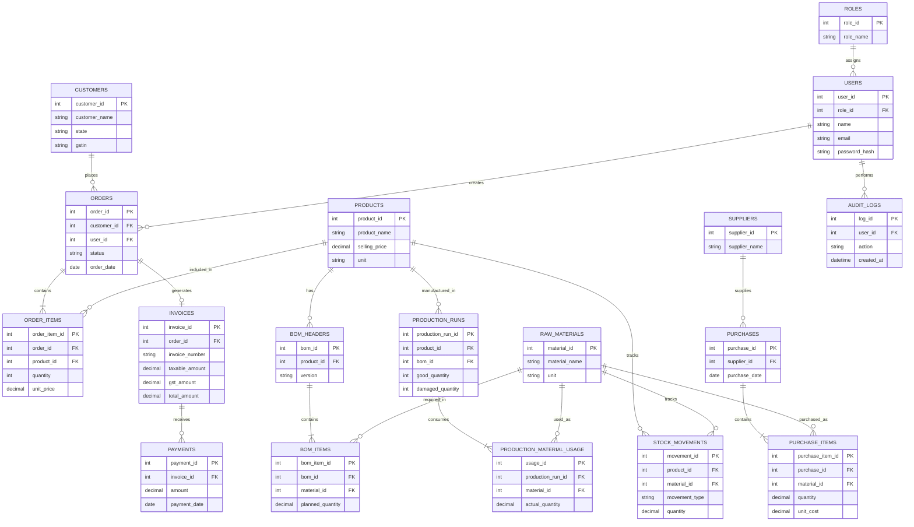

# Entity Relationship Diagram

The following diagram represents the main database entities
and their relationships.

```mermaid
erDiagram
    ROLES ||--o{ USERS : assigns
    CUSTOMERS ||--o{ ORDERS : places
    USERS ||--o{ ORDERS : creates
    ORDERS ||--|{ ORDER_ITEMS : contains
    PRODUCTS ||--o{ ORDER_ITEMS : included_in
    ORDERS ||--o| INVOICES : generates
    INVOICES ||--o{ PAYMENTS : receives

    SUPPLIERS ||--o{ PURCHASES : supplies
    PURCHASES ||--|{ PURCHASE_ITEMS : contains
    RAW_MATERIALS ||--o{ PURCHASE_ITEMS : purchased_as

    PRODUCTS ||--o{ BOM_HEADERS : has
    BOM_HEADERS ||--|{ BOM_ITEMS : contains
    RAW_MATERIALS ||--o{ BOM_ITEMS : required_in

    PRODUCTS ||--o{ PRODUCTION_RUNS : manufactured_in
    PRODUCTION_RUNS ||--|{ PRODUCTION_MATERIAL_USAGE : consumes
    RAW_MATERIALS ||--o{ PRODUCTION_MATERIAL_USAGE : used_as

    PRODUCTS ||--o{ STOCK_MOVEMENTS : tracks
    RAW_MATERIALS ||--o{ STOCK_MOVEMENTS : tracks
    USERS ||--o{ AUDIT_LOGS : performs

    ROLES {
        int role_id PK
        string role_name
    }

    USERS {
        int user_id PK
        int role_id FK
        string name
        string email
        string password_hash
    }

    CUSTOMERS {
        int customer_id PK
        string customer_name
        string state
        string gstin
    }

    PRODUCTS {
        int product_id PK
        string product_name
        decimal selling_price
        string unit
    }

    ORDERS {
        int order_id PK
        int customer_id FK
        int user_id FK
        string status
        date order_date
    }

    ORDER_ITEMS {
        int order_item_id PK
        int order_id FK
        int product_id FK
        int quantity
        decimal unit_price
    }

    INVOICES {
        int invoice_id PK
        int order_id FK
        string invoice_number
        decimal taxable_amount
        decimal gst_amount
        decimal total_amount
    }

    PAYMENTS {
        int payment_id PK
        int invoice_id FK
        decimal amount
        date payment_date
    }

    SUPPLIERS {
        int supplier_id PK
        string supplier_name
    }

    PURCHASES {
        int purchase_id PK
        int supplier_id FK
        date purchase_date
    }

    PURCHASE_ITEMS {
        int purchase_item_id PK
        int purchase_id FK
        int material_id FK
        decimal quantity
        decimal unit_cost
    }

    RAW_MATERIALS {
        int material_id PK
        string material_name
        string unit
    }

    BOM_HEADERS {
        int bom_id PK
        int product_id FK
        string version
    }

    BOM_ITEMS {
        int bom_item_id PK
        int bom_id FK
        int material_id FK
        decimal planned_quantity
    }

    PRODUCTION_RUNS {
        int production_run_id PK
        int product_id FK
        int bom_id FK
        int good_quantity
        int damaged_quantity
    }

    PRODUCTION_MATERIAL_USAGE {
        int usage_id PK
        int production_run_id FK
        int material_id FK
        decimal actual_quantity
    }

    STOCK_MOVEMENTS {
        int movement_id PK
        int product_id FK
        int material_id FK
        string movement_type
        decimal quantity
    }

    AUDIT_LOGS {
        int log_id PK
        int user_id FK
        string action
        datetime created_at
    }
```
